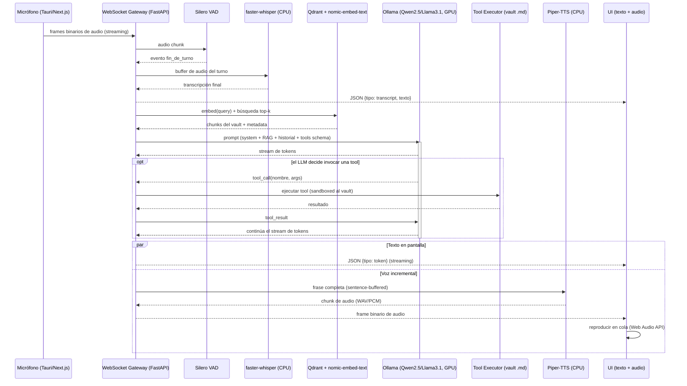

# Arquitectura — offline-personal-assistance

## 1. Decisiones cerradas (no reabrir sin ADR)

| Área | Decisión | Motivo |
|---|---|---|
| Frontend shell | **Tauri** + Next.js/React | Requerimiento explícito de "interfaz ligera"; Electron compite por RAM con Ollama/Qdrant en un presupuesto de 16GB |
| Vector DB | **Qdrant** | Menor huella por vector, mejor filtrado por metadata, modo local + servidor |
| TTS | **Piper-TTS** | Corre 100% en CPU con latencia predecible; libera la GPU para el LLM |
| STT | faster-whisper + Silero VAD, **en CPU** | Misma razón: no competir por VRAM con el LLM |
| LLM | Ollama (Qwen2.5-7B / Llama3.1-8B, Q4/Q5) | Único servicio que usa GPU de forma intensiva |
| Embeddings | `nomic-embed-text` vía Ollama | Reutiliza el mismo runtime que el LLM |

**Presupuesto de recursos (crítico):** con 8GB VRAM, el diseño asume que **solo el LLM ocupa GPU de forma sostenida**. STT, TTS y embeddings corren en CPU. Esto es una restricción de arquitectura, no un detalle de implementación — cualquier cambio que mueva un componente a GPU debe pasar por un ADR revisado por el `software-architect`, porque puede provocar OOM de VRAM justo cuando el usuario habla mientras el LLM está generando una respuesta previa.

## 2. Flujo de datos — de micrófono a voz de respuesta

## 3. Puntos de integración

### 3.1 WebSocket (frontend ↔ orchestrator)
Una sola conexión WS por sesión, multiplexando dos tipos de frame:
- **Frames de control (texto/JSON)**: `{"tipo": "transcript_partial"|"transcript_final"|"token"|"turn_start"|"turn_end"|"tool_call"|"error", ...}`
- **Frames binarios**: audio entrante (mic → backend) y audio saliente (Piper → frontend), diferenciados por un byte de cabecera (`0x01` = audio_in, `0x02` = audio_out).

Este framing es un **contrato compartido** entre `frontend-engineer` y `backend-engineer`: cualquier cambio se refleja en este documento en el mismo commit que el código.

### 3.2 Tool calling (LLM ↔ ejecución real)
Ollama expone tool calling nativo (formato compatible OpenAI). El orchestrator:
1. Envía el schema de tools disponibles junto al prompt.
2. Si el LLM responde con un `tool_call`, el `backend-engineer` lo transporta al `integration-engineer`, quien ejecuta la tool contra el vault (sandboxed).
3. El resultado se re-inyecta como `tool_result` y el LLM continúa el stream.

Tools mínimas de la Fase 3 del roadmap: `buscar_nota`, `crear_nota`, `actualizar_nota`, `listar_tareas`.

### 3.3 RAG (LLM ↔ Qdrant)
Pipeline de indexación (offline/batch, disparado por cambios en el vault):
`vault/*.md → chunking → nomic-embed-text (Ollama) → upsert Qdrant (payload: path, título, heading)`

Pipeline de consulta (por turno de conversación):
`query del usuario → embed → búsqueda top-k en Qdrant → chunks inyectados en el prompt del LLM`

## 4. Gestión de VRAM (responsabilidad cruzada software-architect / devops-engineer)
- Ollama debe configurarse con un `keep_alive` explícito — no infinito por default — para poder liberar VRAM si el sistema detecta presión de memoria.
- STT/TTS/embeddings nunca deben competir por GPU con el LLM salvo decisión explícita documentada en un ADR.
- Cualquier test de carga debe medir VRAM pico con el LLM generando **y** un turno de voz entrante simultáneo — es el peor caso real de uso.
